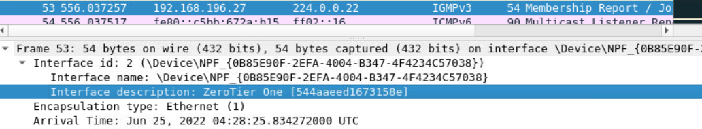
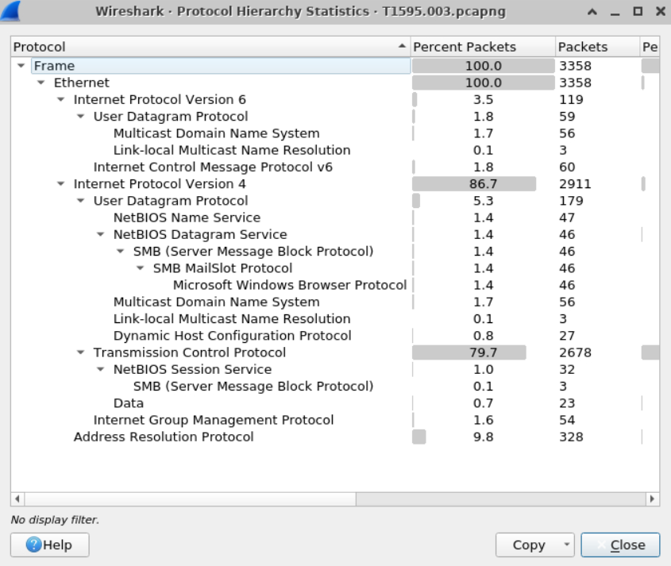
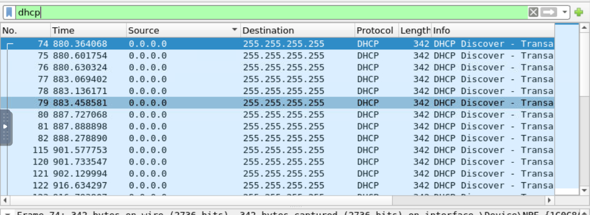
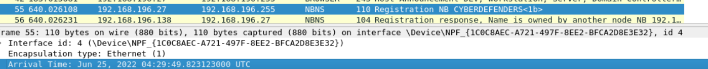
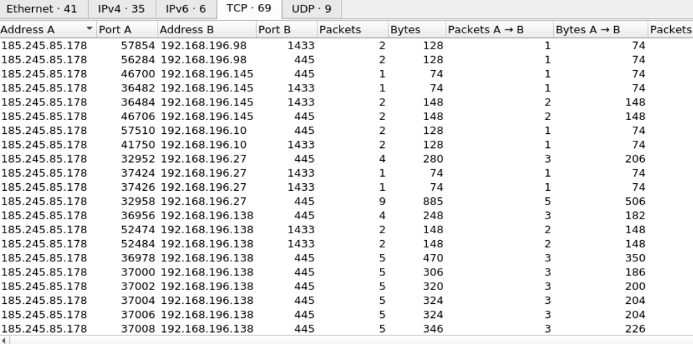
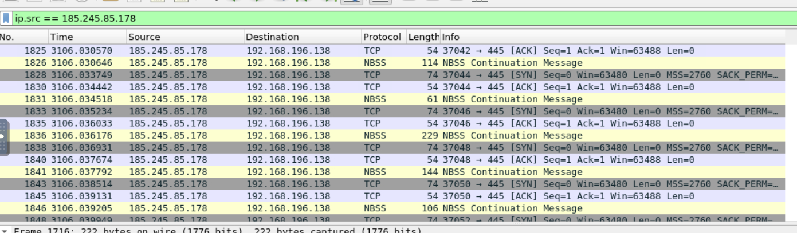
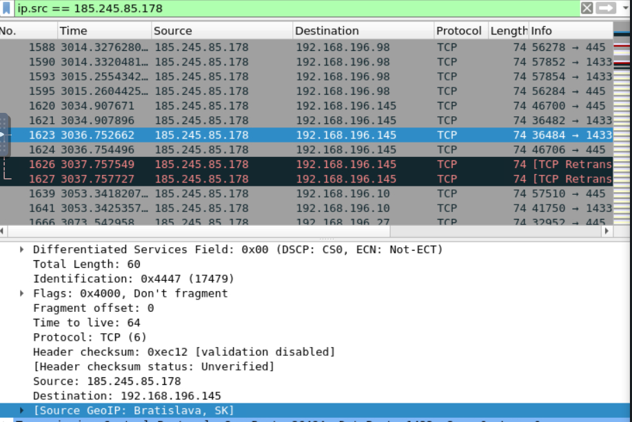

----


# Escenario

Los adversarios pueden ejecutar escaneos de reconocimiento activos para recopilar información que se puede usar durante la selección de objetivos. Los escaneos activos son aquellos en los que el adversario sondea la infraestructura de la víctima a través del tráfico de red, a diferencia de otras formas de reconocimiento que no implican una interacción directa.

Los adversarios pueden realizar diferentes formas de escaneo activo según la información que buscan recopilar. Estos escaneos también se pueden realizar de varias maneras, incluido el uso de funciones nativas de protocolos de red como ICMP. La información de estos escaneos puede revelar oportunidades para otras formas de reconocimiento (p. ej.,  [búsqueda de sitios web/dominios abiertos](https://attack.mitre.org/techniques/T1593)  o  [búsqueda de bases de datos técnicas abiertas](https://attack.mitre.org/techniques/T1596) ), establecimiento de recursos operativos (p. ej.,  [desarrollo de capacidades](https://attack.mitre.org/techniques/T1587)  u  [obtención de capacidades](https://attack.mitre.org/techniques/T1588) ) y/o acceso inicial (p. ej.,  [control remoto externo) . Servicios](https://attack.mitre.org/techniques/T1133)  o  [aprovechar la aplicación de cara al público](https://attack.mitre.org/techniques/T1190) ).

Herramientas:

- [Wireshark](https://www.wireshark.org/download.html)
- [Network Miner](https://www.netresec.com/?page=NetworkMiner)
- [Zui (Brim Security)](https://github.com/brimdata/zui/releases/tag/v1.0.0)

# Preguntas

1. **¿Qué es el ID de red de nivel cero?**

Una dirección ZeroTier identifica un nodo o "dispositivo" (computadora portátil, teléfono, servidor, VM, aplicación, etc.) mientras que una ID de red identifica una red Ethernet virtual a la que pueden unirse dispositivos. Las direcciones ZeroTier se pueden considerar como números de puerto en un enorme conmutador inteligente Ethernet empresarial de todo el planeta que admite VLAN .

Si abrimos el paquete _pcap_ con _Wireshark_ y buscamos la cadena "ZeroThier" obtenemos muchos paquetes cuya descripción de interfaz es la siguiente:


**_544aaeed1673158e_**

2. **¿Cuál es el tamaño de los paquetes ARP en bytes?**

En el menú de estadísticas de Wireshark podemos ver las estadísticas de "jerarquía de protocolos":



A la derecha se puede visualizar que el tamaño de los paquetes _ARP (Address Resolution Protocol)__ es de _9184_ bytes

3. **¿Cuál es la dirección que envió la mayoría de los paquetes?**

Dentro de las estadísticas de conversaciones de Wireshark, podemos ver los paquetes enviados en cada conversación entre IP's, si ordenamos la lista por número de paquetes enviados se puede apreciar que la dirección _243.208.197.200_ ha enviado a una dirección 821 paquetes. Aunque esta dirección no ha enviado paquetes a más direcciones, la suma de de las conversaciones de las demás direcciones IPs no superan ese número.


4. **¿Cuál es la Ciudad de la IP conectada a Filipinas?**

Buscando "Philipines" dentro del archivo _.pcap_ en Wireshark se obtiene la siguiente petición:


La dirección fuente es Filipinas (_49.151.58.90_), en concreto, la ciudad de "La Trinidad".

5. **¿Cuántos mensajes DHCP Discover hay en el archivo pcapng?**

Mediante un filtrp en Wireshark escribiendo sólamente "dhcp" muestra todos los paquetes con protocolo DHCP:


No se puede realizar un filtro en Wireshark para la pestaña "Info" porque no es un campo general.
También se puede realizar una búsqueda del string "DHCP Discover". La respuesta es **_27_**.

6. **¿Cuál es la "dirección MAC de destino" para el paquete 37?**
En la pestaña _Go_ hacemos click en _Go To Packet_ y escribimos el número del paquete.

La dirección MAC de destino es **_0e:9d:89:55:b2:02_**

7. **¿Cuántos paquetes de respuesta hay en el archivo pcapng?**

Esta pregunta me tenía muy confundido porque no sabía si se refería a la suma de los paquetes de respuesta de todos los tipos (ARP, ICMP, DNS, HTTP...) . Me volví loco probando filtros y búsquedas de cadenas de texto pero era más sencillo de lo esperado, la pregunta se refiere a paquetes _ARP_ de respuesta.
Para ello, utilizamos el siguiente filtro:

```bash
arp.opcode == 2
```

Se muestran un total de **_164_** paquetes.


8. **¿A qué hora se envía el paquete 55?**



**_2022-06-25 4:29:49_**

9. **¿Cuál es el rango de las direcciones IP de la red de destino?**

Las direcciones de red de destino van desde la 192.168.196.0 (host) hasta la 192.168.196.255 (broadcast)

**_192.168.196.0/24_**

10. **¿Cuáles son los números de puerto a los que apunta el atacante?**

En la pestaña de _Conversations_ vemos como una IP externa manda paquetes TCP a una dirección de la red desde distintos puertos y siempre a los puertos 445 o 1433 (_NetBios via SMB y SQL Server_):


Si a su vez, utilizamos el filtro:

```bash
ip.src == 185.245.85.178
```


Podemos ver una gran cantidad de paquetes TCP y NBSS. NBSS es un servicio que se utiliza para conectar dos computadoras para transmitir mensajes grandes o tráfico de datos pesado.
**_445,1433_**

Por otro lado, si exportamos en Wireshark la captura de paquetes como _.pcap_ y la abrimos con _NetworkMiner_, en la pestaña de "Sesiones" se pueden apreciar multitud de conexiones desde la IP del atacante al host _dev.local_ a través de los puertos 445 y 1433.

- **¿Cuál es el país donde se encuentra el atacante?**

A través de aplicar un filtro en Wireshark para que sólamente se muestren paquetes con dirección fuente la dirección del atacante, se puede apreciar en la información de los paquetes que todos tienen como información de geolocalización: [SourceGeoIP: Bratislava, SK].

```bash
ip.src == 185.245.85.178
```


**_Slovakia_**

12. **¿Cuál es el nombre del Threat Actor con el que está asociada esta técnica?**

En esta pregunta estuve atascado más de un día. A través de búsquedas en Google conseguí entender que no se refería al tipo de Threat Actor, sino al nombre de la organización atacante.
Navegando por la web de MITRE | ATTACK, dentro de la técnica llamada como el desafío (T1595) se muestran nombres de organizaciones de Threat Actors.
Esta técnica tiene a su vez tres subtécnicas, y una de ellas se trata del escaneo de vulnerabilidades. Como en este desafío el atacante apunta a los puertos NetBios vía SMB y SQL Server, suponemos que está buscando vulnerabilidades. Dentro de este enlace: https://attack.mitre.org/techniques/T1595/002/ se nombran varios grupos delictivos, y en este caso, _APT28_ es la respuesta correcta


# Tags

#wireshark #mitre   #zui #T1595 #networkminner #pcap


