----
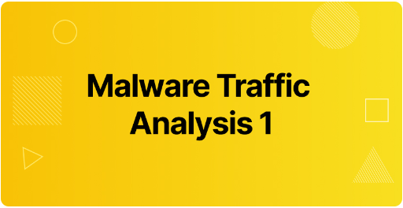
# Escenario

El PCAP adjunto pertenece a una infección de Exploitation Kit. Como miembro del equipo azul de seguridad, analícelo con su herramienta favorita y responda las preguntas de desafío.

Herramientas:
- [BrimSecurity](https://www.brimsecurity.com/)
- [suricatarunner](https://github.com/brimsec/build-suricata/releases/tag/v5.0.3-brim1)
- [suricata.rules](https://download.cyberdefenders.org/BlueYard/misc/suricata.zip)
- [NetworkMiner](https://www.netresec.com/?page=networkminer)
- [WireShark](https://www.wireshark.org/)

# Contexto 

Una máquina Windows accede a un sitio web infectado.


# Preguntas

1. **¿Cuál es la dirección IP de la máquina virtual de Windows que se infecta?**

- **_Forma 1_**:

Para averiguar qué dirección IP ha sido infectada, en lo primero que debemos pensar es en buscar direcciones IP privadas que se hayan conectado a internet. Existen tres rangos de IP privadas:
- Clase A: _10.0.0.0 a 10.255.255.255_. Se emplean en grandes empresas y permiten crear hasta 126 redes distintas.
- Clase B: _172.16.0.0 a 172.31.255.25_. Se emplean en organizaciones de tamaño medio.
- Clase C: _192.168.0.0 a 192.168.255.255_. Su uso es doméstico.

Abrimos la captura de tráfico en Wireshark y observamos que hay varias direcciones IP privadas. Filtrando ahora el tráfico _http_, observamos que hay conexiones con IPs públicas, pero en concreto, una conexión de _172.16.165.165_  accede a una multitud de sitios web no comunes.
Entendemos que, la IP del equipo infectado es _172.16.165.165_.

- **_Forma 2_**:
Por otro lado, a través de _NetworkMiner_ es más sencillo de obtener direcciones IPs y hosts:
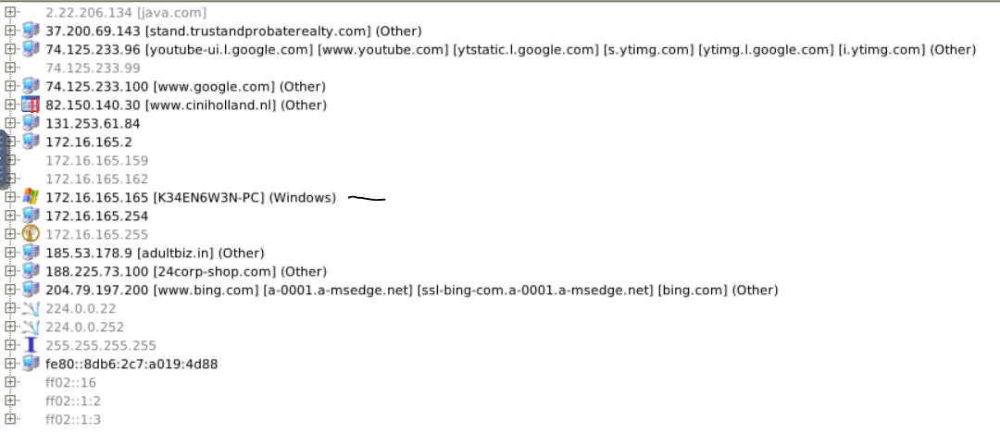
Se puede apreciar que hay un unico host Windows.

- **_Forma 3_**: Brim y Suricata

Abrimos el archivo _.pcap_ con Brim

2. **¿Cuál es el nombre de host de la máquina virtual de Windows que se infecta?**

Para responder a esta pregunta tuve que recopilar información sobre identificar hosts y usuarios en Wireshark. Para ello, debemos prestar especial atención al tráfico DHCP y NBNS. Fuente: (https://unit42.paloaltonetworks.com/using-wireshark-identifying-hosts-and-users/#:~:text=Open%20the%20pcap%20in%20Wireshark%20and%20filter%20on%20nbns.,as%20shown%20in%20Figure%205.&text=The%20frame%20details%20section%20also,as%20shown%20in%20Figure%206.)
El tráfico DHCP ayuda a identificar hosts para cualquier tipo de equipo conectada a una red, y el tráfico NBNS se genera por equipos Windows o MacOS.

Para filtrar tráfico por DHCP debemos usar el filtro:
```bash
dhcp
```
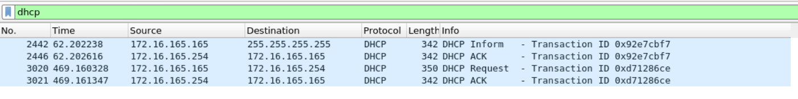

Ahora, debemos fijarnos en el paquete con información de solicitud DHCP que coincide con la fuente de la IP infectada. Dentro de la pestaña de _Dynamic Host Configuration Protocol (Request)_ del paquete podemos encontrar una opción llamada _Hostname_:
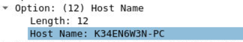

Nombre del host: **_K34EN6W3N-PC_**.

3. **¿Cuál es la dirección MAC de la máquina virtual infectada?**

En los detalles del paquete de la pregunta anterior podemos encontrar también la dirección MAC del equipo infectado:
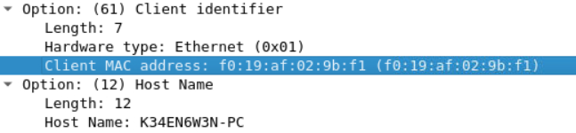

4. **¿Cuál es la IP del sitio web infectado?**

Filtrando por conexiones http se visualiza que la máquina víctima accede a diferentes páginas web.
El host Windows accede a los siguientes sitios web:
- _bing_, cuya IP es 204.79.197.200, Hace una solicitud de tipo _POST_ y posteriormente una _GET_ para buscar el término _ciniholland.nl_.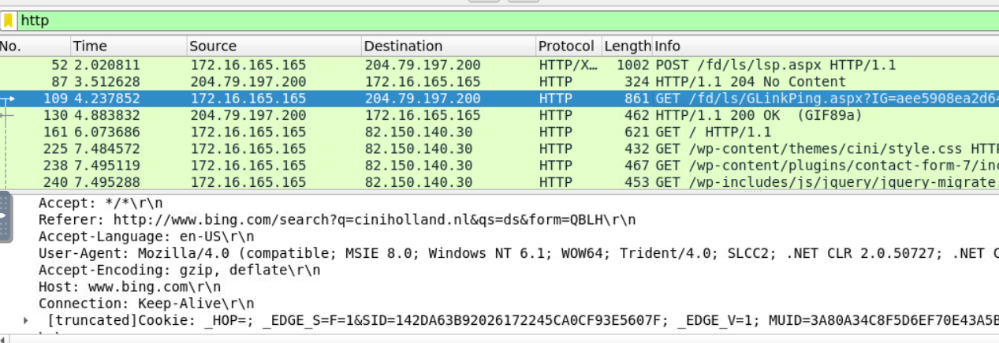

- _ciniholland.nl_, cuya IP es 82.150.140.30. A través de _bing_ (referer) entra al sitio web cuyo host es "www.ciniholland.nl". A partir de ese momento se realizan una multitud de peticiones desde la máquina víctima hacia ese sitio web.
- _24corp-shop.com_, cuya IP se corresponde com 188.225.73.100
- _stand.trustandprobaterealty.com_. cuya IP se corresponde con 37.200.69.143
- _adultbiz.in_

Si accedemos a _Statistics>HTTP>Request Sequences_ podemos observar todo lo anterior de una forma más intuitiva:
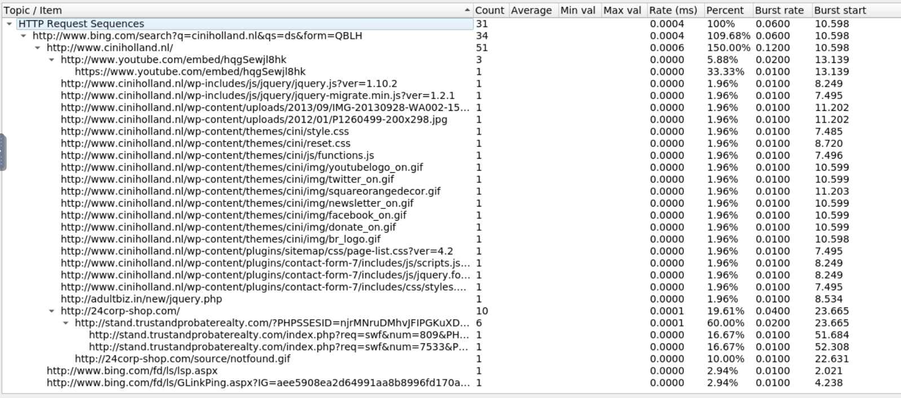
La mayor parte de peticiones HTTP se realizan al sitio web de _ciniholland_ y este causa redireccionamientos maliciosos, por lo que suponemos que está infectado. Por tanto, la IP es la de este sitio web: _82.150.140.30_.


5. **¿Cuál es el FQDN del sitio web comprometido?**

Ya se ha respondido en la pregunta anterior: _http://ciniholland.nl_

6. **¿Cuál es la dirección IP del servidor que entregó el kit de explotación y el malware?**

Lo más apropiado para esta pregunta es usar _Brim_. Con el siguiente filtro podemos filtrar por alertas:
```bash
event_type="alert"
```
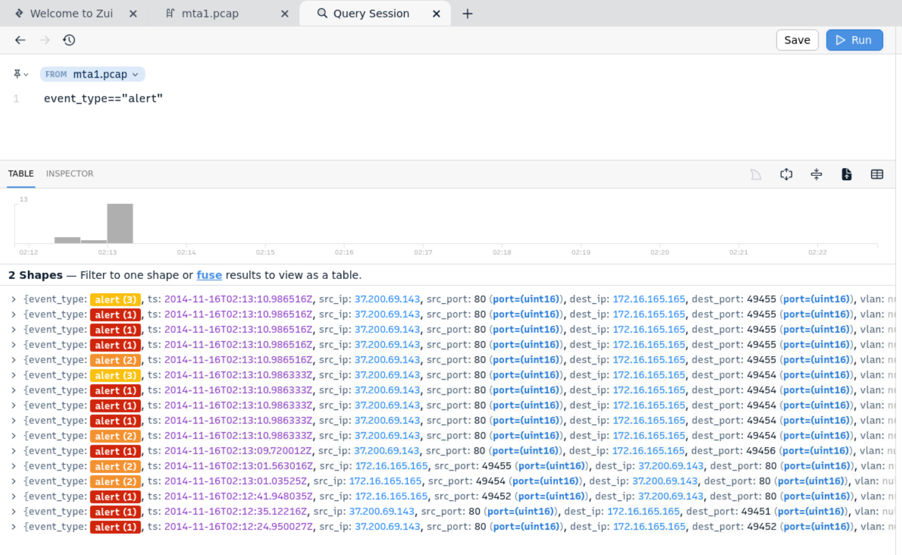

Aquí se puede apreciar como esta alerta proviene de la IP _37.200.69.143_, que entrego el kit de explotación y el malware al host infectado:
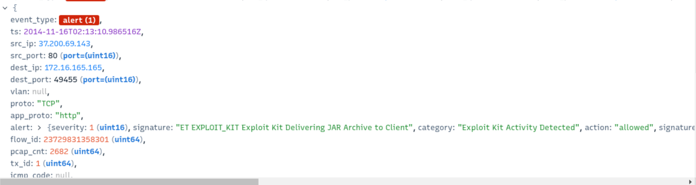

7. **¿Cuál es el FQDN que entregó el kit de explotación y el malware?**

_stand.trustandprobaterealty.com_

8. **¿Cuál es la URL de redireccionamiento que apunta a la página de inicio del kit de explotación (EK)?**

Se refiere al campo "referer" de la solicitud HTTP que apunta a _stand.trustandprobaterealty.com_. A través de Wireshark, filtramos por paquetes http y dirección _37.200.69.143_:
```bash
http && ip.addr == 37.200.69.143
```

Como estamos sólamente viendo paquetes con destino a esa dirección, el primer paquete enviado a esa dirección es redireccionado por otra página: _http://24corp-shop.com_. 
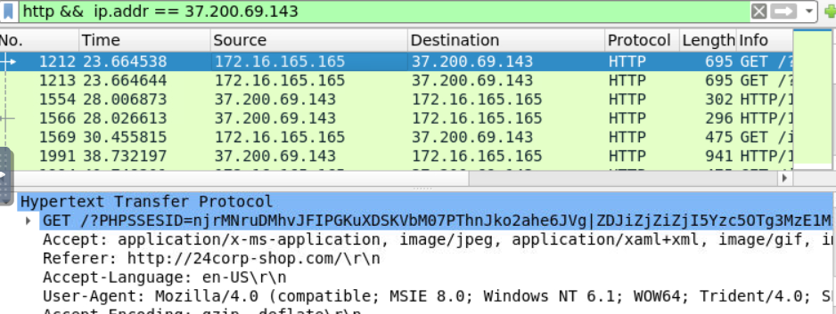

Otra forma de ver esto gráficamente es en _Statistics>HTTP>Request Sequences_:
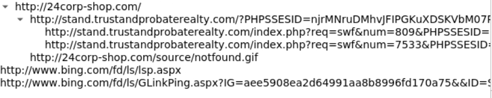

9. **Además del exploit CVE-2013-2551 IE, el EK apuntó a otra aplicación que comienza con "J". Proporcione el nombre completo de la aplicación.**

En _Brim_ con la query :
```bash
event_type="alert" dest_ip=172.16.165.165
```
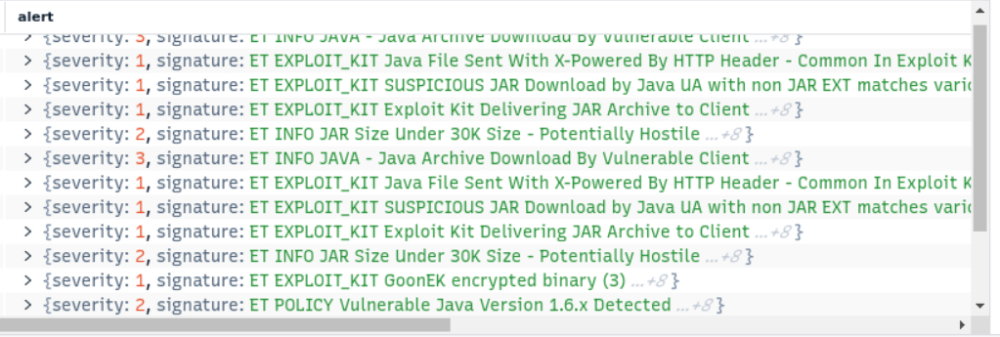

**_Java_**

10. **¿Cuántas veces se entregó la carga útil?**
En Wireshark, exportamos la lista de objetos HTTP y obtenemos una multitud de archivos provenientes de la URL que entrega el kit de explotación y malware:
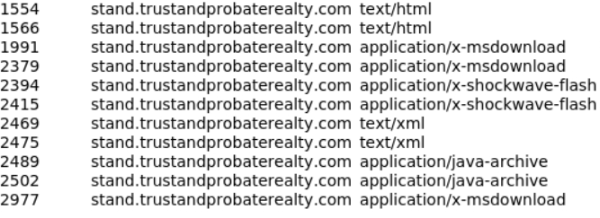

Subimos varios de ellos a _VirusTotal_ y son reportados como maliciosos:
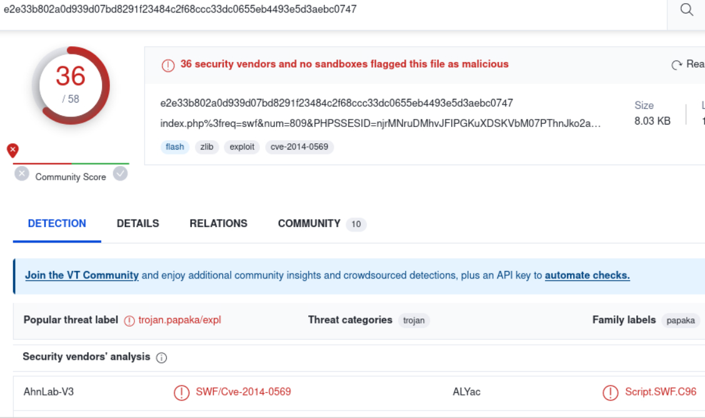

Por otro lado, la carga util es el objeto _x-shockwave-flash_, y se entrega 3 veces.

11. **El sitio web comprometido tiene un script malicioso con una URL. ¿Qué es esta URL?**

http://24corp-shop.com

12. **Extraiga los dos archivos de explotación. ¿Qué son los hashes de archivos MD5? (separado por comas**

Subimos los archivos correspondientes a los objetos exportados _java-archive_ y _x-shockwave-flash_ a _VirusTotal_ y obtenemos los hases MD5.

_7b3baa7d6bb3720f369219789e38d6ab,1e34fdebbf655cebea78b45e43520ddf_

# Tags

#wireshark #pcap #network #malwaretrafficanalysis #brim 