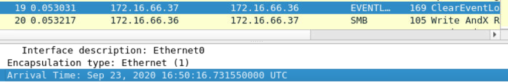
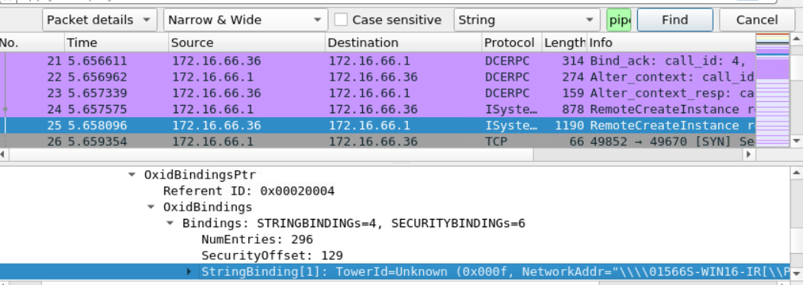
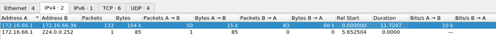
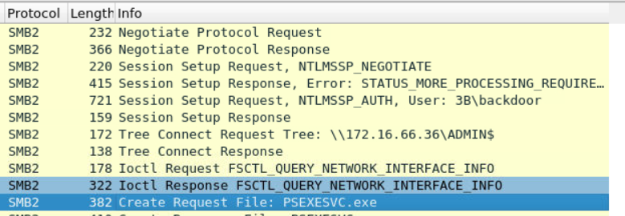

----

# Escenario

Como analista de SOC, explore una colección de archivos pcap de Wireshark que profundizan en varias tácticas de ataque, incluida la evasión y el movimiento lateral. Analice el tráfico de red capturado dentro de estos pcaps para descubrir información valiosa y detectar posibles actividades de comando y control (C&C).

# Preguntas

1. **Archivo => Tráfico-1  
¿Cuál es la cantidad de ancho de banda que utiliza el protocolo SMB en bytes?**

Dentro de _Statistics>Protocol Hierarchy_ se puede apreciar que el ancho de banda que utiliza el protocolo SMB en este archivo _.pcap_ es de _4406_ bytes

2. **Archivo => Tráfico-1 ¿Qué nombre de usuario se utilizó para la autenticación a través de SMB?**
Examinando el paquete número 5, podemos ver el usuario que se utilizó para la autenticación NTLMSSP: _Administrator_:

3. **Archivo => Tráfico-1 ¿Cuál es el nombre del archivo que se abrió?**

En el paquete 7 hay una solicitud de conexión al recurso compartido _IPC$_ (info: _Tree Connect andX Request_). Por otro lado, en el paquete 9 se solicitó la apertura del archivo _eventlog_ (info: _NT Create AndX Request_).

4. **Archivo => Tráfico-1 ¿Cuál es la marca de tiempo del intento de borrar el registro de eventos? (24H-UTC)**
El paquete 19 tiene como info _ClearEventLogW request_ inmediatamente despés de abrir el registro de eventos.

**_2020-09-23 16:50:16_**

5. **Archivo => Tráfico-2 Un atacante usó una canalización con nombre para la comunicación para mezclarse y evadir la detección. ¿Cuál es el nombre del servicio que utilizó esta tubería para la comunicación?**
Para ello, se hace uso del buscador. Con la siguiente configuración se busca _pipe_:

Se trata del servicio _atsvc_. Es un servicio de Windows que se encarga de la conmutación automática de una conexión de red entre diferentes interfaces de red o adaptadores. Este servicio se utiliza principalmente en entornos de redes con múltiples adaptadores de red o interfaces de red, como en equipos con conexiones Ethernet y Wi-Fi.

6. **Archivo => Tráfico-2  
¿Cuál fue la duración de la comunicación entre 172.16.66.1 y 172.16.66.36?**
Se puede visualizar como una estadística. _Statistics>Conversations_:

**_11.7247_**

7. **Archivo => Tráfico-3 ¿  
Qué nombre de usuario se usa para configurar solicitudes que pueden considerarse sospechosas?**
Nada más abrir el archivo de tráfico 3 nos encontramos una solicitud para una autenticación NTLMSSP vía SMB2 del usuario _3B\backdoor_, un nombre bastante sospechoso, ya que luego también intenta acceder al recurso _ADMIN$_. También intenta ejecutar posteriormente _psexesvc.exe_, que se utiliza para ejecutar comandos o programas de forma remota en una máquina específica. e la máquina local y la máquina remota:

8. **Archivo => Traffic-3  
¿Cuál es el nombre del archivo ejecutable utilizado para ejecutar procesos de forma remota?**

Se responde en la pregunta anterior: _psexesvc.exe_. Se corresponde con la herramienta _PSExec_.

# Tags

#wireshark #pcap #smb

