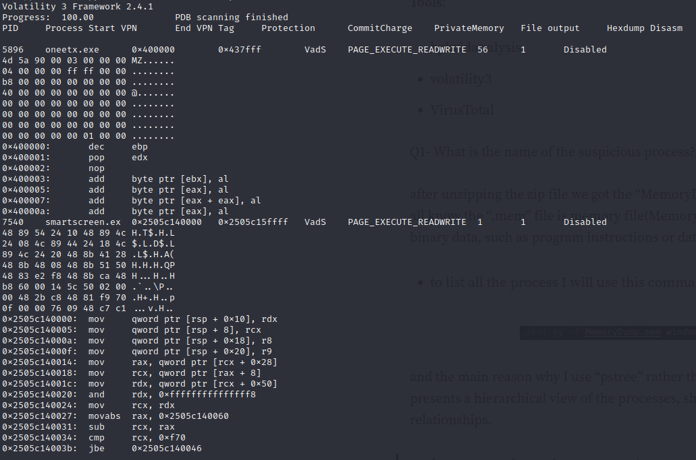
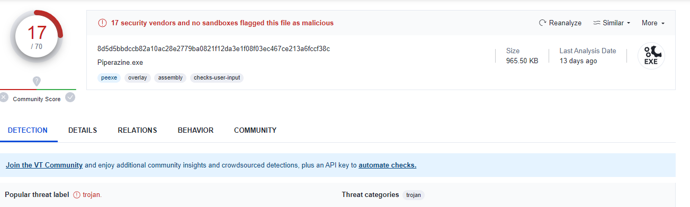
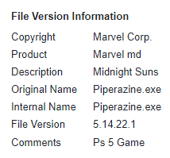
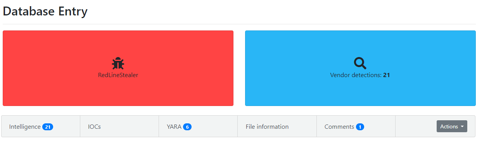

----

# Escenario

Como miembro del equipo de Security Blue, su tarea es analizar un volcado de memoria utilizando las herramientas Redline y Volatility. Su objetivo es rastrear los pasos tomados por el atacante en la máquina comprometida y determinar cómo lograron eludir el Sistema de detección de intrusos en la red "NIDS". Su investigación implicará identificar la familia de malware específica empleada en el ataque, junto con sus características. Además, su tarea es identificar y mitigar cualquier rastro o huella dejada por el atacante.

# Preguntas

1. **¿Cómo se llama el proceso sospechoso?**

Se hace uso de Volatility. Mediante _windows.psscan_ mostrará todos los procesos de la imagen proporcionada:

```bash
python3 vol.py -f /home/kali/volatility/mem.mem windows.psscan
```

Pero será más útil con el comando _windows.pstree_, ya qué muestra los procesos en forma de árbol:

```bash
python3 vol.py -f /home/kali/volatility/mem.mem windows.pstree
```

Entre todos los procesos, muestra dos que parecen maliciosos:

```bash
5896    8844    oneetx.exe      0xad8189b41080  5       -       1       True    2023-05-21 22:30:56.000000      N/A
* 7732  5896    rundll32.exe    0xad818d1912c0  1       -       1       True    2023-05-21 22:31:53.000000      N/A
```

Es común utilizar en Volatility  _windows.malfind_ para buscar posibles indicadores de malware en la memoria del sistema. Examina la memoria en busca de patrones y características sospechosas que podrían indicar la presencia de código malicioso. Esto puede incluir ganchos de funciones sospechosas, cadenas encriptadas, shellcodes, DLL inyectadas y otros comportamientos anómalos asociados con malware. Ejecutaremos ese comando para ver si nos reporta algo:

```bash
python3 vol.py -f /home/kali/volatility/mem.mem windows.malfind
```

Como podemos ver, reporta el proceso _oneetx.exe_ como malicioso.

2. **¿Cuál es el nombre del proceso secundario del proceso sospechoso?**

Gracias a _windows.pstree_ podemos observar que el proceso secundario del malicioso es _rundll32.exe_

3. **¿Cuál es la protección de memoria aplicada a la región de memoria de proceso sospechosa?**

_Info:_ La protección de memoria aplicada a la región de memoria de un proceso son las medidas y restricciones que se imponen a una región de memoria dentro del espacio de direcciones de memoria de un sistema operativo. Cada proceso tiene su espacio de direcciones virtuales que se dividenen varias regiones, y cada una de estas regiones puede tener una protección especifica.

Estas protecciones pueden ser:
- Protección de lectura
- Protección de escritura
- Protección de ejecución
- Protección de acceso

En Volatility, con el comando _memmap_ se puede ver la protección de memoria aplicada a una región de memoria de un proceso. Necesitamos el PID del proceso (5896)

```bash
volatility --profile=PerfilVolatility -f mem.mem memmap -p 5896
```

Pero algo más simple es a través de _windows.malfind_:

```bash
python3 vol.py -f /home/kali/volatility/mem.mem windows.malfind
```

El método de protección es _PAGE_EXECUTE_READWRITE_

4. **¿Cuál es el proceso responsable de la conexión VPN?**

Enumeramos todos los procesos de nuevo y buscamos...
```bash
*** 6724        3580    Outline.exe     0xad818e578080  0       -       1       True    2023-05-21 22:36:09.000000      2023-05-21 23:01:24.000000 
**** 4224       6724    Outline.exe     0xad818e88b080  0       -       1       True    2023-05-21 22:36:23.000000      2023-05-21 23:01:24.000000 
**** 4628       6724    tun2socks.exe   0xad818de82340  0       -       1       True    2023-05-21 22:40:10.000000      2023-05-21 23:01:24.000000
```
_tun2socks.exe_ es un archivo ejecutable que forma parte de la aplicación Tun2Socks. Tun2Socks es una herramienta de red que permite enrutar el tráfico de red a través de una conexión VPN o un túnel SOCKS. A la vez, es un proceso secundario de _Outline.exe_.   
"outline.exe" es un archivo ejecutable que forma parte de la aplicación Outline. Outline es una herramienta de código abierto desarrollada por Jigsaw (una subsidiaria de Alphabet Inc., la empresa matriz de Google) que facilita la creación y gestión de servidores VPN de acceso privado.

5. **¿Cuál es la dirección IP del atacante?**

Observamos las conexiones en el momento de la captura de la imagen mediante _windows.netscan_:

```bash
python3 vol.py -f /home/kali/volatility/mem.mem windows.netscan
```

Y buscamos la asociada al proceso maligno:

```bash
0xad818de4aa20  TCPv4   10.0.85.2       55462   77.91.124.20    80      CLOSED  5896    oneetx.exe      2023-05-21 23:01:22.000000 
0xad818df1d920  TCPv4   192.168.190.141 55433   38.121.43.65    443     CLOSED  4628    tun2socks.exe   2023-05-21 23:00:02.000000 

```

Como vimos anteriormente que el proceso maligno es _Oneetx.exe_, la IP será la que se muestra anteriormente.

6. **Basado en los artefactos anteriores. ¿Cuál es el nombre de la familia de malware?**

Para ello, podemos realizar un volcado de archivos asociados al proceso malicioso (PID: 5896) con _windows.dumpfiles_:

```bash
python3 vol.py -f /home/kali/volatility/mem.mem windows.dumpfiles --pid 5896


ImageSectionObject      0xad818da36c30  oneetx.exe      file.0xad818da36c30.0xad818ca48660.ImageSectionObject.oneetx.exe.img
```

Con MD5sum podemos ver el hash MD5 del archivo y conseguir información en _VirusTotal_:

```bash
md5sum file.0xad818da36c30.0xad818ca48660.ImageSectionObject.oneetx.exe.img
f40168cc10f8cb6fe05322fc391e6947  file.0xad818da36c30.0xad818ca48660.ImageSectionObject.oneetx.exe.img

```


Podemos verificar que es un troyano, y si buscamos la dirección ip del atacante en Google:


Tiene la firma de _RedLineStealer_

- **¿Cuál es la URL completa del archivo PHP que visitó el atacante?**

Debemos de analizar los "strings" del volcado de memoria:
```bash
strings mem.mem
```
Pero muestra muchisima información, así que:
```bhas
strings mem.mem | grep "77.91.124.20"

http://77.91.124.20/ E
77.91.124.20/stor 
http://77.91.124.20/store/gamel
ttp://77.91.124.20/store/games/i
77.91.124.20
http://77.91.124.20/ E
http://77.91.124.20/DSC01491/
77.91.124.20
http://77.91.124.20/DSC01491/
http://77.91.124.20/store/games/index.php
77.91.124.20
77.91.124.20
77.91.124.20
77.91.124.20
77.91.124.20
http://77.91.124.20/store/games/index.php
http://77.91.124.20/store/games/index.php

```

- **¿Cuál es la ruta completa del ejecutable malicioso?**
```bash
strings mem.mem | grep "oneetx.exe"

oneetx.exe
{"ProcessID":6352,"ProcessSequenceNumber":1135,"CreateTime":"2023-05-21T22:59:01.1823237Z","ExitTime":"2023-05-21T22:59:04.4115824Z","ExitCode":0,"TokenElevationType":3,"HandleCount":54,"CommitCharge":1417216,"CommitPeak":1458176,"CPUCycleCount":51305780,"ReadOperationCount":0,"WriteOperationCount":0,"ReadTransferKiloBytes":0,"WriteTransferKiloBytes":0,"HardFaultCount":41,"ImageName":"oneetx.exe"}
{"ProcessID":8532,"ProcessSequenceNumber":1134,"CreateTime":"2023-05-21T22:59:00.9282569Z","ExitTime":"2023-05-21T22:59:04.4761938Z","ExitCode":0,"TokenElevationType":3,"HandleCount":167,"CommitCharge":41648128,"CommitPeak":41684992,"CPUCycleCount":582094609,"ReadOperationCount":14,"WriteOperationCount":0,"ReadTransferKiloBytes":53,"WriteTransferKiloBytes":0,"HardFaultCount":389,"ImageName":"oneetx.exe"}
TRACE,0016,8844,LogEvents,ProcessStart,C:\Users\Tammam\AppData\Local\Temp\c3912af058\oneetx.exe
TRACE,0016,5896,LogEvents,ProcessStart,C:\Users\Tammam\AppData\Local\Temp\c3912af058\oneetx.exe


```


# Tags

#volatility #nids #ids #redline #strings